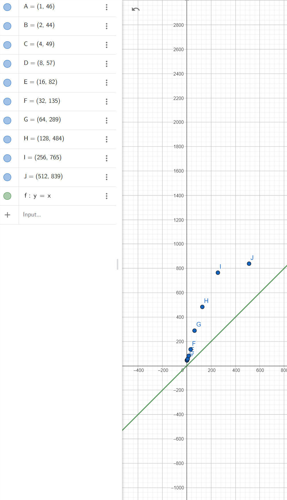

# Hash-generator

## Pseudo-kodas

### Funkcija Hex(num)
    Inicializuoti hexGalimi su "0123456789abcdef"
    Inicializuoti result kaip tuščią eilutę

    Kol num didesnis už 0:
        result = hexGalimi[num & 15] + result
        num = num >> 4

    Grąžinti result

### Funkcija hashFunkcija(input)
    Inicializuoti hash su 0
    Inicializuoti prime su 31

    Kiekvienam simboliui c iš input:
        hash = hash * prime + c * (c + 7) + 12345

    Inicializuoti resultHex su Hex(hash)

    Kol resultHex ilgis mažesnis nei 64:
        Kiekvienam simboliui c iš resultHex:
            hash = hash * prime + c * (c + 5) + 54321
        resultHex = resultHex + Hex(hash)

    Grąžinti resultHex nuo 0 iki 64 simbolių

## Tyrimai

| Failo pavadinimas          | Hash (64 simbolių hex)                                                      |
|----------------------------|-----------------------------------------------------------------------------|
| test_files\file1.txt       | 6e22e28a55b90e80341940122402beb422bf3570a8116c7e8c1b647554fa8b88            |
| test_files\file1.txt       | 6e22e28a55b90e80341940122402beb422bf3570a8116c7e8c1b647554fa8b88            |
| test_files\file2.txt       | 95992174acf05f809ecc65c1ede917941ce469381e2ff8dc27190e4798a0491e            |
| test_files\file3.txt       | fa6a63958206f39bdd79fc6c5b9809cb9ac5c168a28003cb38546805ccdc9bcf            |
| test_files\file4.txt       | 92fc2d8bdfea2c51291d039ae2ed6273b6d86e879694419122f9bcf2aac59167            |
| test_files\file5.txt       | 8ccc214713d764fd33efc20458f207fb85822013f906d025be7e348384a3a413            |
| test_files\file6.txt       | fe4cb60474282a415eb5318c65a59ab1fc35c9ae875bd43fa7db707f483b8ec1            |
| test_files\file7.txt       | 0de21187bd4c15862f107f5b4aaff69230ea6e9b19bb80946100795e88c00888            |

## Hasho efektyvumo analizė
 
| Eilučių skaičius | Vidutinis laikas (ms) |
|------------------|-----------------------|
| 1                | 0.00464               |
| 2                | 0.00416               |
| 4                | 0.0049                |
| 8                | 0.0057                |
| 16               | 0.00822               |
| 32               | 0.01352               |
| 64               | 0.02892               |
| 128              | 0.04848               |
| 256              | 0.0765                |
| 512              | 0.08395               |

Matome, kad vidutinis laikas didėja logaritmiškai. Priklausomybė yra logaritminė, kompleksiškumas O(log N).

## Kolizija

**Total string pairs checked:** `100,000`

**Total collisions found:** `0`

**Collision rate:** `0%`

## Lavina

| Metric                          | Value       |
|---------------------------------|-------------|
| **Total string pairs processed**| `100,000`   |
| **Bit-Level Percentage Differences** |         |
| &nbsp;&nbsp;&nbsp;&nbsp;**Min** | `41.4062 %` |
| &nbsp;&nbsp;&nbsp;&nbsp;**Max** | `83.9844 %` |
| &nbsp;&nbsp;&nbsp;&nbsp;**Avg** | `63.8929 %` |
| **Hex-Level Percentage Differences** |         |
| &nbsp;&nbsp;&nbsp;&nbsp;**Min** | `65.625 %`  |
| &nbsp;&nbsp;&nbsp;&nbsp;**Max** | `100 %`     |
| &nbsp;&nbsp;&nbsp;&nbsp;**Avg** | `90.3923 %` |

## Išvados

### Stiprybės
- **Efektyvumas:** Hash funkcija yra efektyvi, vidutinis laikas didėja O(log n).
- **Kolizijų nebuvimas:** Patikrinus 100,000 string porų, nebuvo rasta nė vienos kolizijos.
- **Lavinos efektas:** Bitų ir heksadecimalių lygių skirtumai rodo stiprų lavinos efektą.

### Trūkumai
- **Bitų lygio skirtumai:** Minimali bitų lygio skirtumo reikšmė yra 41.4062 %, kas gali būti trūkumas.
- **Heksadecimalių lygio skirtumai:** Minimali heksadecimalių lygio skirtumo reikšmė yra 65.625 %, kas gali būti trūkumas.

Apibendrinant, hash funkcija yra efektyvi ir patikima, tačiau galima patobulinti bitų ir heksadecimalių lygio skirtumus.